# Algorithm & Architecture Flowcharts

This document contains detailed Mermaid.js flowcharts for the five core components
of the resume-ranking system implemented in this thesis project.  Each diagram is
derived directly from the source code and reflects actual class names, function names,
file names, and key variables.

---

## 1. TF-IDF / BM25 — Lexical Retrieval Stage

> **Source file:** `resume_reviewer/resume_processor/hybrid_ranker.py`
> **Key functions:** `_tokenize()`, `_bm25_rank()`, `_bm25_fallback()`

```mermaid
flowchart TD
    A([Input: resume_texts\nList of str\njob_description str]) --> B

    subgraph tokenize ["hybrid_ranker.py — _tokenize()"]
        B["_tokenize(text)\nre.findall(r'[a-zA-Z0-9]+', text.lower())"]
        B --> C["corpus_tokens: List[List[str]]\njd_tokens: List[str]"]
    end

    C --> D

    subgraph bm25rank ["hybrid_ranker.py — _bm25_rank()"]
        D{rank_bm25\navailable?}
        D -- Yes --> E["from rank_bm25 import BM25Okapi\nbm25 = BM25Okapi(corpus_tokens)\nscores = bm25.get_scores(jd_tokens)"]
        D -- No  --> F["_bm25_fallback(corpus_tokens, jd_tokens\n  k1=1.5, b=0.75)"]

        subgraph fallback ["_bm25_fallback() — pure-Python BM25-Okapi"]
            F --> G["Compute doc lengths: dl = [len(doc) for doc in corpus_tokens]\navgdl = dl.mean()"]
            G --> H["Build doc-frequency dict: df[term] = count of docs containing term"]
            H --> I["For each query token q:\n  idf = log((n − df[q] + 0.5) / (df[q] + 0.5) + 1.0)"]
            I --> J["For each doc i:\n  tf = doc.count(q)\n  denom = tf + k1*(1 − b + b*dl[i]/avgdl)\n  scores[i] += idf * (tf*(k1+1)) / denom"]
            J --> K["Return np.ndarray scores"]
        end

        E --> L
        K --> L
        L["indexed = [(i, float(scores[i])) for i in range(n)]\nindexed.sort(key=lambda x: x[1], reverse=True)"]
    end

    L --> M([Output: bm25_ranking\nList[Tuple[int, float]]\nsorted descending by BM25 score])
```

**Explanation:** The lexical stage tokenizes every resume text and the job description with `_tokenize()`, which uses a simple alphanumeric regex and lowercases everything.  `_bm25_rank()` then tries to use the `rank_bm25.BM25Okapi` library; when that is unavailable it falls back to the pure-Python `_bm25_fallback()` that computes BM25-Okapi scores manually (IDF × TF saturation formula, `k1=1.5`, `b=0.75`).  The result is a list of `(resume_index, bm25_score)` tuples sorted in descending order, ready to be fused in Stage 3.

---

## 2. S-BERT — Semantic Retrieval Stage

> **Source files:** `resume_reviewer/resume_processor/hybrid_ranker.py`,
>                   `resume_reviewer/resume_processor/text_processor.py`
> **Key functions / classes:** `_get_sbert()`, `_sbert_rank()`, `chunk_text_for_sbert()`
> **Model:** `all-MiniLM-L6-v2` (constant `SBERT_MODEL_NAME`)

```mermaid
flowchart TD
    A([Input: resume_texts List[str]\njd_text str]) --> B

    subgraph loader ["hybrid_ranker.py — _get_sbert() lazy singleton"]
        B{_sbert_model\nis None?}
        B -- Yes --> C["from sentence_transformers import SentenceTransformer\n_sbert_model = SentenceTransformer('all-MiniLM-L6-v2')"]
        B -- No  --> D["Return cached _sbert_model"]
        C --> D
    end

    D --> E

    subgraph prep ["text_processor.py — chunk_text_for_sbert()"]
        E["chunk_text_for_sbert(text, max_tokens=512)\n  words = text.split()\n  max_words = max(1, int(512/1.3))\n  Yield overlapping word-window chunks"]
        E --> F["chunks: List[str] per resume\n(≤ 512 tokens each, ~1.3 tokens/word)"]
    end

    F --> G

    subgraph encode ["hybrid_ranker.py — _sbert_rank()"]
        G["all_texts = [jd_text] + resume_texts\n(jd_text at index 0)"]
        G --> H["embeddings = model.encode(\n  all_texts,\n  show_progress_bar=False,\n  normalize_embeddings=True\n)\n→ L2-normalised dense vectors"]
        H --> I["jd_emb    = embeddings[0]\nresume_embs = embeddings[1:]"]
        I --> J["similarities = resume_embs @ jd_emb\n(dot product ≡ cosine sim for L2-normed vecs)"]
        J --> K["indexed = [(i, float(similarities[i])) for i in range(n)]\nindexed.sort(key=lambda x: x[1], reverse=True)"]
    end

    K --> L([Output: sbert_ranking\nList[Tuple[int, float]]\nsorted descending by cosine similarity])
```

**Explanation:** `_get_sbert()` lazy-loads the `SentenceTransformer("all-MiniLM-L6-v2")` model as a module-level singleton so its 80 MB weights are only loaded once per process.  `_sbert_rank()` prepends the job-description text to the list of resume texts and calls `model.encode()` with `normalize_embeddings=True`, which produces L2-normalised 384-dimensional vectors; cosine similarity then reduces to a simple matrix–vector dot product (`resume_embs @ jd_emb`).  The function returns `(resume_index, similarity_score)` pairs sorted descending, consumed by the RRF fusion step.

---

## 3. Reciprocal Rank Fusion (RRF)

> **Source file:** `resume_reviewer/resume_processor/hybrid_ranker.py`
> **Key function:** `_rrf_fuse()`
> **Constant:** `RRF_K = 60`

```mermaid
flowchart TD
    A([Input: bm25_ranking\nList[Tuple[int,float]]]) --> C
    B([Input: sbert_ranking\nList[Tuple[int,float]]]) --> C

    subgraph rrf ["hybrid_ranker.py — _rrf_fuse(*rankings, k=RRF_K)"]
        C["rrf_scores: Dict[int, float] = {}"]
        C --> D["For each ranking in (bm25_ranking, sbert_ranking):"]
        D --> E["  For rank_pos, (idx, _score) in enumerate(ranking):\n    rrf_scores[idx] += 1.0 / (k + rank_pos + 1)\n    where k = RRF_K = 60"]
        E --> F{More\nrankings?}
        F -- Yes --> D
        F -- No  --> G["fused = sorted(\n  rrf_scores.items(),\n  key=lambda x: x[1],\n  reverse=True\n)"]
    end

    G --> H["rrf_scores dict used for tier check"]
    G --> I["rrf_vals = [sc for _, sc in rrf_ranking]\nrrf_norm_list = _min_max_normalise(rrf_vals)\nrrf_norm = {idx: normalised_score}"]

    subgraph normalise ["hybrid_ranker.py — _min_max_normalise()"]
        I --> J["lo, hi = min(values), max(values)\nif hi − lo < 1e-9: return [0.5]*n\nreturn [(v − lo)/(hi − lo) for v in values]"]
    end

    J --> K([Output: rrf_ranking\nList[Tuple[int, rrf_score]]\n+ rrf_norm Dict[int, float → 0..1]])
```

**Explanation:** `_rrf_fuse()` accepts any number of sorted ranked lists (here the BM25 and SBERT rankings) and for each list accumulates `1 / (RRF_K + rank_position + 1)` into a per-resume dictionary.  The constant `RRF_K = 60` dampens the influence of extreme rank differences as recommended in the original Cormack et al. paper.  Fused scores are then min-max normalised by `_min_max_normalise()` so they fall in `[0, 1]`, providing the fallback `final_score` for resumes that are not sent to the Cross-Encoder.

---

## 4. Cross-Encoder Reranking

> **Source file:** `resume_reviewer/resume_processor/hybrid_ranker.py`
> **Key functions:** `_get_ce()`, `_cross_encoder_rerank()`
> **Model:** `cross-encoder/ms-marco-MiniLM-L-6-v2` (constant `CE_MODEL_NAME`)
> **Constant:** `CE_TOP_K_DEFAULT = 10`

```mermaid
flowchart TD
    A([Input: resume_texts List[str]\njd_text str\ncandidate_indices List[int]\n= top-K from RRF]) --> B

    subgraph loader ["hybrid_ranker.py — _get_ce() lazy singleton"]
        B{_ce_model\nis None?}
        B -- Yes --> C["from sentence_transformers import CrossEncoder\n_ce_model = CrossEncoder(\n  'cross-encoder/ms-marco-MiniLM-L-6-v2'\n)"]
        B -- No  --> D["Return cached _ce_model"]
        C --> D
    end

    D --> E

    subgraph rerank ["hybrid_ranker.py — _cross_encoder_rerank()"]
        E["pairs = [(jd_text, resume_texts[idx])\n         for idx in candidate_indices]"]
        E --> F["raw_scores = model.predict(\n  pairs,\n  show_progress_bar=False\n)\n→ raw logit per (JD, resume) pair"]
        F --> G["sigmoid(x) = 1.0 / (1.0 + exp(−x))\nMaps logits → [0, 1]"]
        G --> H["results = [(candidate_indices[i], sigmoid(raw_scores[i]))\n           for i in range(len(candidate_indices))]"]
        H --> I["results.sort(key=lambda x: x[1], reverse=True)"]
    end

    I --> J([Output: ce_results\nList[Tuple[int, float]]\nsorted descending by CE score])

    J --> K["ce_scores = {idx: score for idx, score in ce_results}"]
    K --> L{Resume i in\nce_scores and\nce_scores[i] > 0?}
    L -- Yes --> M["sc.final_score = ce_scores[i]\ntier = 'ce_reranked'"]
    L -- No  --> N["sc.final_score = rrf_norm[i]\ntier = 'rrf_only'"]
```

**Explanation:** `_get_ce()` lazy-loads `CrossEncoder("cross-encoder/ms-marco-MiniLM-L-6-v2")` as a module-level singleton.  `_cross_encoder_rerank()` builds `(job_description, resume_text)` string pairs for the top-K candidates from RRF (default `CE_TOP_K_DEFAULT = 10`) and calls `model.predict()` to obtain raw logit scores; these are converted to probabilities with a sigmoid function.  The two-tier assignment logic in `HybridRanker.rank()` then uses the CE sigmoid score as `final_score` for reranked candidates and falls back to the normalised RRF score for any resume outside the top-K.

---

## 5. Overall Logical Architecture

> **Source files:** `views.py`, `async_processor.py`, `batch_processor.py`,
>                   `enhanced_pdf_parser.py`, `text_processor.py`, `hybrid_ranker.py`,
>                   `nlg_generator_enhanced.py`
> **Entry class:** `BatchProcessor` → `HybridRanker`

```mermaid
flowchart TD
    U([User Browser]) -->|POST PDF files| V1
    U -->|POST JD text / criteria| V2

    subgraph django ["Django — views.py / urls.py"]
        V1["resume_upload(request)\nstores PDFs via Resume model\nstores paths in session"]
        V2["jd_new(request)\nparse_criteria_from_post()\nbuild_jd_text()\nstores JD in session"]
        V1 --> V3["start_batch_processing_async(task_id)\nasync_processor.py — background thread"]
        V2 --> V3
    end

    subgraph batch ["batch_processor.py — BatchProcessor.process_batch()"]
        V3 --> BP1["Step 1: _parse_pdfs_to_json(resume_paths)\nThreadPoolExecutor (PARSE_CONCURRENCY workers)\n→ PDFParser.parse_resume(path)"]

        subgraph pdf ["enhanced_pdf_parser.py — PDFParser"]
            BP1 --> PDF1["fitz / PyMuPDF extraction\nor pytesseract OCR fallback\n→ raw_text str"]
            PDF1 --> PDF2["_normalize_sections(raw_text)\nsection_mapping dict\n→ sections: {experience, skills, education, misc}"]
            PDF2 --> PDF3["ParsedResume(id, sections, meta, scores, matched_skills, parsed)"]
        end

        PDF3 --> BP2["Step 2: normalize_job_description(jd_text)\ntext_processor.py\n→ jd_normalized dict with clean skill tokens"]

        BP2 --> HR["Step 3: HybridRanker.rank(\n  parsed_resumes,\n  jd_normalized,\n  top_k=min(10, n)\n)"]

        subgraph hybrid ["hybrid_ranker.py — HybridRanker.rank()"]
            HR --> H1["Build corpus:\n  resume_texts = [_resume_to_text(r) for r in parsed_resumes]\n  corpus_tokens = [_tokenize(t) for t in resume_texts]\n  jd_tokens = _tokenize(job_description)"]
            H1 --> H2["Stage 1 — BM25\n_bm25_rank(corpus_tokens, jd_tokens)\n→ bm25_ranking List[Tuple[int,float]]"]
            H1 --> H3["Stage 2 — SBERT\n_sbert_rank(resume_texts, jd_text)\n→ sbert_ranking List[Tuple[int,float]]"]
            H2 --> H4["Stage 3 — RRF\n_rrf_fuse(bm25_ranking, sbert_ranking, k=60)\n→ rrf_ranking, rrf_norm Dict[int,float]"]
            H3 --> H4
            H4 --> H5["Stage 4 — Cross-Encoder\n_cross_encoder_rerank(\n  resume_texts, jd_text,\n  top_k_indices[:CE_TOP_K_DEFAULT]\n)\n→ ce_scores Dict[int,float]"]
            H5 --> H6["Score assignment per resume:\n  sc.tfidf_section_score  = bm25_scores[i]\n  sc.semantic_score       = sbert_scores[i]\n  sc.cross_encoder        = ce_scores[i]\n  sc.final_score = CE score (top-K) or RRF norm (rest)"]
            H6 --> H7["Build final_ranking List[Dict]\n  rank, id, reasoning, scores_snapshot"]
        end

        H7 --> BP3["Step 4: _assemble_output(\n  parsed_resumes, final_ranking,\n  job_description, jd_criteria\n)"]

        subgraph nlg ["nlg_generator_enhanced.py — EnhancedCandidateAnalyzer"]
            BP3 --> NLG1["_generate_detailed_score_breakdown()\n→ signal_scores (tfidf/sbert/cross_encoder)\n   base_composite, coverage_analysis"]
            NLG1 --> NLG2["NLG summary text per candidate\n→ candidate.nlg_summary str"]
        end

        NLG2 --> OUT["output Dict:\n  resumes, final_ranking,\n  batch_summary, success"]
    end

    OUT --> R1["ranking_view(request) → ranking.html\nranking_list(request) → ranking_list.html\ncandidate_detail(request, id) → candidate_detail.html"]
    R1 --> U
```



**Explanation:** The user submits a job description and a batch of PDF resumes through the Django front end (`views.py`); `start_batch_processing_async()` hands off to `BatchProcessor.process_batch()` in a background thread.  The batch processor first parses every PDF with `PDFParser` (fitz/PyMuPDF with a pytesseract OCR fallback) into the `ParsedResume` dataclass, normalises the JD text, and then delegates the entire scoring pipeline to `HybridRanker.rank()`, which runs the four stages (BM25 → SBERT → RRF → Cross-Encoder) and populates each resume's `ResumeScores` object.  Finally, `_assemble_output()` calls `EnhancedCandidateAnalyzer` to generate NLG summaries and structured score breakdowns, and the assembled results are served back to the user through the ranking views.
