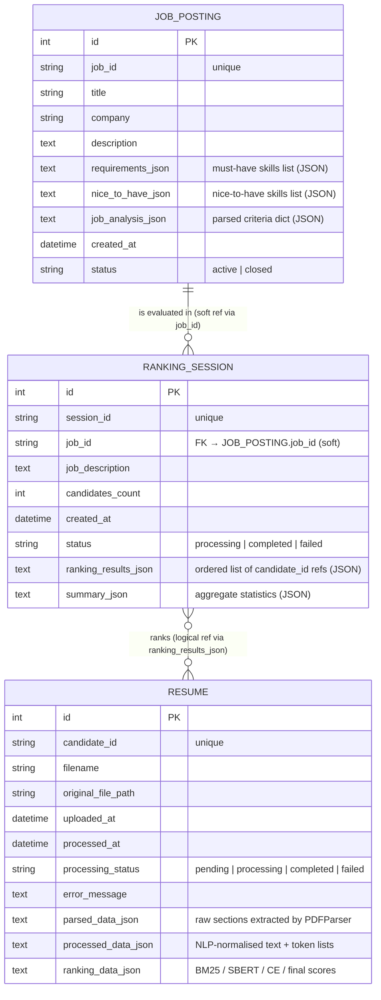
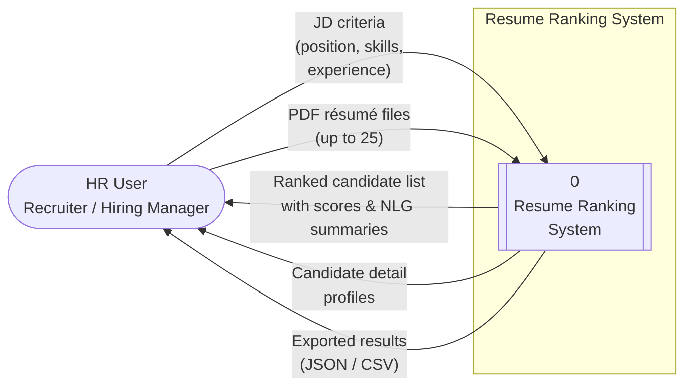
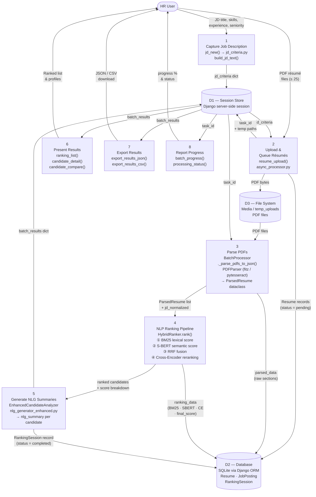
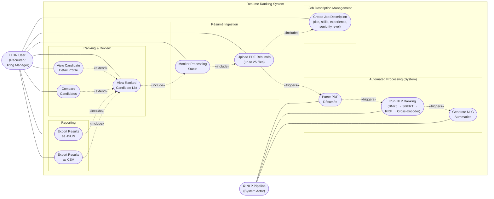

# System Diagrams

This document contains three core system diagrams for the Resume Ranking System:
an Entity-Relationship Diagram (ERD), a Dataflow Diagram (DFD), and a Use Case
Diagram.  All diagrams are written in Mermaid.js and reflect the actual source
code in this repository.

---

## 1. Entity-Relationship Diagram (ERD)

> **Source file:** `resume_reviewer/resume_processor/models.py`
>
> The system stores three first-class entities.  `RankingSession` holds a soft
> reference to `JobPosting` via the `job_id` string field (no database-level
> foreign key because the original schema targets SQLite).  Every resume that is
> uploaded and processed belongs conceptually to a `RankingSession`; the
> relationship is captured inside the `ranking_results_json` column of
> `RankingSession`, which is an array of `candidate_id` references.

---

## 2. Dataflow Diagram (DFD)

### Level 0 — Context Diagram

> The system receives job-description criteria and PDF résumés from the HR User
> and returns ranked candidate lists, individual profiles, and exportable reports.

---

### Level 1 — Decomposed DFD

> Each numbered process maps directly to a module in the repository.

---

## 3. Use Case Diagram

> **Actor:** HR User (Recruiter / Hiring Manager) — the single human actor who
> interacts with the system.  The **NLP Pipeline** is shown as a secondary
> (system) actor to highlight that automated ranking is triggered internally.

**Use-case narrative summary**

| ID   | Use Case                  | Primary Actor | Pre-condition                        | Post-condition                              |
|------|---------------------------|---------------|--------------------------------------|---------------------------------------------|
| UC1  | Create Job Description    | HR User       | —                                    | JD criteria stored in session               |
| UC2  | Upload PDF Résumés        | HR User       | JD criteria exists in session        | PDFs saved; background task started         |
| UC3  | Monitor Processing Status | HR User       | Background task is running           | User sees real-time progress %              |
| UC4  | View Ranked Candidate List| HR User       | Processing completed                 | Ordered list with scores displayed          |
| UC5  | View Candidate Detail     | HR User       | Candidate exists in batch results    | Full profile + NLG summary shown            |
| UC6  | Compare Candidates        | HR User       | ≥ 2 candidates in results            | Side-by-side score comparison               |
| UC7  | Export Results as JSON    | HR User       | Batch results available              | `export.json` file downloaded               |
| UC8  | Export Results as CSV     | HR User       | Batch results available              | `export.csv` file downloaded                |
| UC9  | Parse PDF Résumés         | NLP Pipeline  | PDFs queued by UC2                   | `ParsedResume` objects created              |
| UC10 | Run NLP Ranking           | NLP Pipeline  | `ParsedResume` list ready            | Scores (BM25 / SBERT / RRF / CE) assigned   |
| UC11 | Generate NLG Summaries    | NLP Pipeline  | Ranking scores computed              | Natural-language rationale per candidate    |
